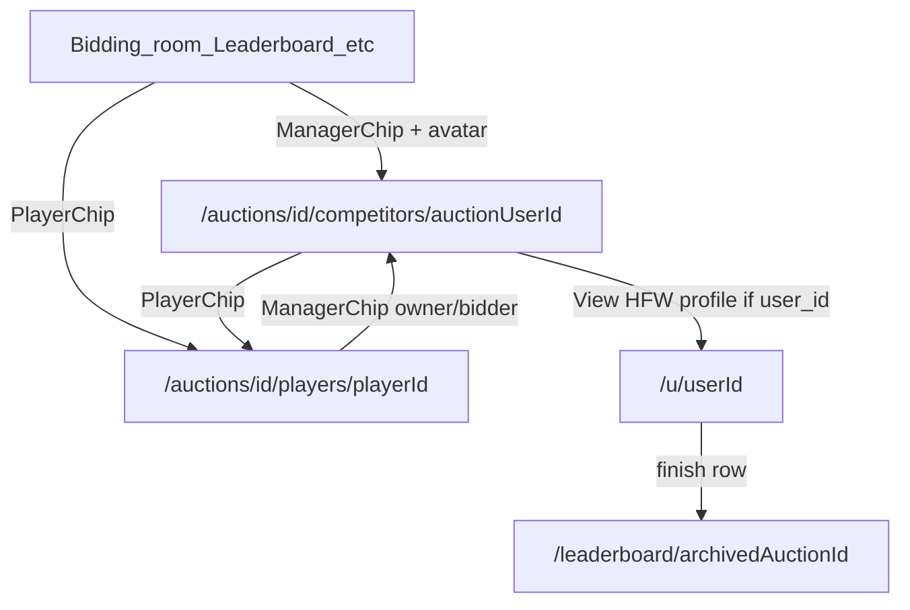

# Entity interconnect plan (pages & links)

**Status:** Phase 1 implemented (manager links + avatars in auction). Phases 2–3 not started. Deploy phase-by-phase; do not ship all at once.  
**Audience:** Humans and agents working on auction-app UI.  
**Related:** [OPS_UI_SURFACES.md](./OPS_UI_SURFACES.md), [USER_UI_AND_DEPLOYMENT.md](./USER_UI_AND_DEPLOYMENT.md), [AGENT_HANDOFF.md](./AGENT_HANDOFF.md)

---

## Product intent

Make the auction app feel like a real website: every meaningful name (manager, player, profile) is a hyperlink to a dedicated page. Managers can navigate from bidding room / leaderboard / anywhere into a competitor’s team, a player’s auction story, or another user’s HFW profile.

---

## Locked product rules

1. **Platform profiles** (`/u/[userId]`): any **signed-in** HFW user may view another user’s:
   - `display_name`
   - `avatar_url`
   - past auction finishes (archived tournaments only)
   - **Nothing else** (no email, budgets, live squads, private settings).
2. **Player pages**: stay **in-auction**. Enrich `/auctions/[auctionId]/players/[playerId]` for **auction members only**. No platform-wide football-player career page in this plan.
3. **Phased delivery**: each phase below is independently deployable.

---

## What already exists (baseline)

| Surface | Route / code | Today |
|---------|----------------|-------|
| Competitor list + detail | `/auctions/[id]/competitors`, `.../competitors/[auctionUserId]` | Team + bids held; players link out |
| Player detail | `/auctions/[id]/players/[playerId]` | Thin: status, high bid, bid form |
| Bidding room | `BiddingRoomClient.tsx` | Player names link; **high bidder is plain text** |
| Leaderboard | `StandingsTable.tsx` | Manager names are **plain text** |
| Own history | `/auction-history` | Self-only finishes via `loadAuctionHistoryForUser` |
| Avatars | `profiles.avatar_url` + Storage `avatars` bucket | Dashboard upload only (`ProfileAvatar`) |
| Profiles RLS | `auth-and-join.sql` | Select/update **own** row only |

Key loaders/types: `lib/auction-dashboard.ts` (`CompetitorView`, `loadCompetitorView`), `lib/auction-history.ts`, `lib/leaderboard-data.ts`, `lib/auction-users-query.ts` (`user_id` on seats).  
SQL already supporting richer player pages: `auction_bids`, `auction_teams`, `auction_releases`, `player_scores`.

---

## Feasibility summary

| Ask | Feasible? | Notes |
|-----|-----------|--------|
| Click competitor from bidding / leaderboard → team + bids | Yes — mostly wiring | Destination already exists |
| Rich in-auction player page (owner, price, GW points, releases) | Yes — data exists | Page exists but thin |
| Click person → platform profile (avatar + finishes) | Yes — new route | Reuse history loader; field allowlist |
| Avatar chips + zoom on profile | Yes | Storage already public-read |
| Search people on the platform | Yes — new | Auth-gated `display_name` search |
| Search football players across all auctions | Out of scope | Player pages remain in-auction |

---

## Entity model (two identities)

Do **not** collapse these:

| Identity | ID | Page | Means |
|----------|-----|------|--------|
| **Auction seat** | `auction_users.id` | `/auctions/[auctionId]/competitors/[auctionUserId]` | What they’re doing in *this* league (team, bids, budget) |
| **Platform user** | `profiles.id` = auth uid (`auction_users.user_id`) | `/u/[userId]` | Who they are on HFW (avatar, name, past finishes) |

**Chip behaviour inside an auction:** primary click → competitor page; secondary control “View HFW profile” when `user_id` is set.

---

## Shared UI primitives

Add once (suggested: `app/_components/entity/`):

1. **`ManagerChip`** — optional small avatar + name/team → competitor page when `auctionId` + `auctionUserId` known.
2. **`PlayerChip`** — player name → player route with `?returnTo=`.
3. **`ProfileChip` / `ProfileLink`** — avatar + name → `/u/[userId]`.
4. **`Avatar`** — sizes `xs` (inline tables), `sm`, `lg`; initials fallback; lightbox/zoom on profile page.

**Data:** join `auction_users.user_id` → `profiles.avatar_url` in auction user fetch / dashboard enrichment (extend `fetchAuctionUsers` / related). Avoid N+1 avatar queries in tables.

---

## Phase 1 — Manager links + avatars in auction

**Status: done (code).**

**Goal:** From bidding room, leaderboard, player “high bidder”, etc., clicking a manager name opens the same competitor page as the Competitors tab. Small avatars beside names.

**Shipped:**
- `app/_components/entity/Avatar.tsx`, `ManagerChip.tsx`
- `lib/profile-avatars.ts` + avatar join in `fetchAuctionUsers` / `fetchAuctionUserNames`
- `EnrichedLot.high_bidder_avatar_url`, `StandingEntry.avatarUrl`
- Wired: bidding room, standings, GW squad headers, competitors list/detail, player high bidder

**Deployable alone.** No new public profile routes required.

---

## Phase 2 — Rich in-auction player page

**Goal:** Click a footballer → full story **for this auction only** (membership already gated by auction layout).

**Page sections:**
1. Header — name, club, position, lot status, timer if bidding
2. Current ownership — owner `ManagerChip` + purchase price (or unsold / bidding held by…)
3. Points this auction — GW → points (`player_scores` / patterns in `lib/leaderboard-data.ts`)
4. Bid history — chronological `auction_bids` for this player in this auction
5. Ownership / release timeline — `auction_releases` + current `auction_teams`
6. Existing bid form when eligible

**Loader:** new `loadPlayerAuctionDetail(auctionId, playerId)` — do **not** fold into the full dashboard payload.

**Deployable alone** after Phase 1 (so owner/bidder names are clickable).

---

## Phase 3 — Platform profiles + people search + avatar zoom

**Goal:** Leave the auction into someone’s HFW page; search users; enlarge avatar.

**Route:** `/u/[userId]` — auth-gated in middleware (same class as `/dashboard`).

**Page content (strict allowlist):**
- Large avatar (click → lightbox / zoom)
- Display name
- Past finishes (generalize `loadAuctionHistoryForUser` to any auth user id; same archived-auction rules)
- Finish rows link to `/leaderboard/[auctionId]`

**Data access:** prefer service-role loader with explicit field allowlist (`id`, `display_name`, `avatar_url`) — matches existing app pattern. Optional RLS for defense in depth (signed-in select of those columns only).

**People search:** auth-gated; `profiles.display_name` ilike → `/u/[id]`. No cross-auction football-player search.

**Entry points:** “View HFW profile” on competitor page when `user_id` present; optional hub search entry.

---

## Phase 4 — Optional polish (later)

- From a profile finish, deep-link to that user’s archived competitor seat if resolvable
- Transfers / announcements use the same chips
- Live-auction participants where `user_id` maps
- Consistent avatar URL cache-busting in chips

---

## UI feel guidelines

- Names are links whenever a destination exists (same visual language as current player links in the bidding room).
- Avatars stay small inline in tables; full-size only on `/u/...` and competitor headers.
- Copy: **“View team”** (in-auction) vs **“View HFW profile”** (platform).
- Preserve `?returnTo=` so Back returns to bidding room / leaderboard / search.

---

## Explicit non-goals

- Platform-wide football player pages / cross-auction career
- Anything on profiles beyond name, avatar, past finishes
- One-shot deploy of all phases
- Global app chrome redesign (feature-local shells are fine)

---

## Recommended build order

1. Primitives + avatar join + Phase 1 manager links  
2. Phase 2 player detail  
3. Phase 3 `/u/[userId]` + people search + lightbox  
4. Phase 4 polish as needed  

---

## Agent notes

- Prefer extending existing competitor/player routes over inventing parallel pages.
- Keep auction membership checks for player detail; keep profile pages signed-in-only with a hard field allowlist.
- When implementing, update this doc’s **Status** line and tick phases done so future agents know what shipped.
